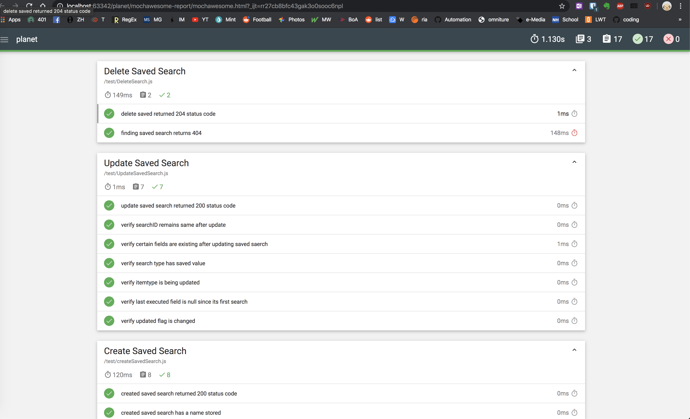

# Planet API Tests

API tests for create, updated and delete saved search. Using itemtype PSScene3Band

## Getting Started

### Prerequisites

Node.js installed (https://nodejs.org/en/)

### Installing

run `npm install`

## Running the tests

`mocha --reporter mochawesome`

### Test Framework

Mocha framework

Lib folder has savedSearch which has create, update, find & delete saved search helper methods

### Test Files

    createSavedSearch.js
    updateSavedSearch.js
    deleteSavedSearch.js

## Reporter
    using mochawesome reporter. sample screenshot
    
   

